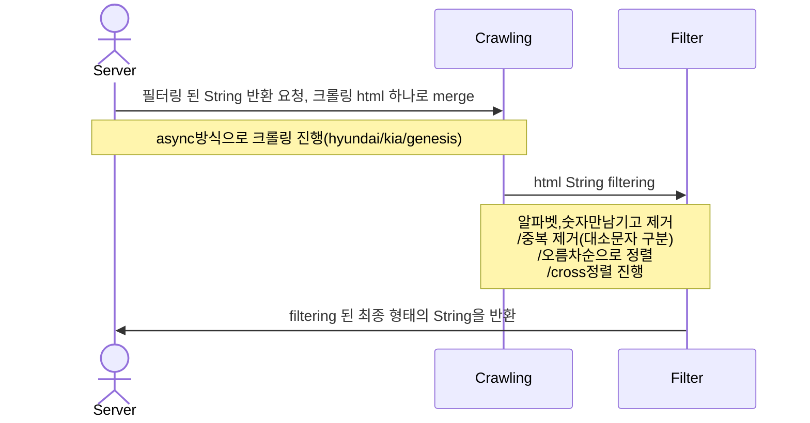

# KIA 과제

## Environments
* Amazon Corretto Version 17.0.7
* Spring Boot 3.1.0
* Gradle
* lombok
* jsoup

## Process
### html filtering

```mermaid
sequenceDiagram
    actor Server
    participant Crawling
    participant Filter
    Server->>Crawling: 필터링 된 String 반환 요청, 크롤링 html 하나로 merge
    Note over Server, Crawling: async방식으로 크롤링 진행(hyundai/kia/genesis)  
    Crawling->>Filter: html String filtering
    Note over Crawling, Filter: 알파벳,숫자만남기고 제거<br/>/중복 제거(대소문자 구분)<br/>/오름차순으로 정렬<br/>/cross정렬 진행
    Filter->>Server: filtering 된 최종 형태의 String을 반환
```
# 프로젝트 패키지 구성

# 프로젝트 테스트 코드 구성 

## 프로젝트 회고
