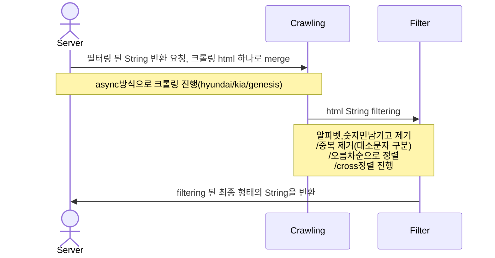

# KIA 과제 
(특정 웹사이트를 크롤링한 데이터를 요구 조건에 맞추어 Json 형태로 출력)

## Environments
* Amazon Corretto Version 17.0.7
* Spring Boot 3.1.0
* Gradle
* lombok
* jsoup
  
## Process
### html filtering

## 프로젝트 패키지 구성
* src.main.javacom.kia.assignment
    * controller
    * constant
    * dto
    * service
* src.test.java.com.kia.assignment
    * controller
    * service

## 프로젝트 테스트 코드 구성 
1. FilterStringControllerTest.java - 문자열 출력 api 컨트롤러 테스트
    * givenTestData_whenGetFilterString_thenResponseCheck
      
      response status, body json 검증, content type(json)
      
    * givenTestDataNothing_whenGetFilterString_thenApplyEhcacheCheck
      
      ehcache 테스트
      
3. CrawlingServiceTest.java - 크롤링 테스트
    * givenTestDataNothing_whenGetAllAsyncCrawling_thenGetHtmlStringCheck
      
      정상 html merge return 테스트
      
    * givenTestData_whenGetCrawlingByUrlAndGetAllAsyncCrawling_thenTimeCheck
      
      크롤링 대상 하나에 소모되는 시간과 전체 크롤링에 소모 시간 테스트
      
    * givenTestDataNothing_whenAsyncWork_thenExcuteIgnoreOrderCheck
      
      병렬 처리 테스트 (시작 시점은 같고 종료시점이 다르므로 실행순서는 동일해야함)
      
4. MakeStringServiceTest.java - 문자열 생성 테스트
    * givenTestData_whenGetFilterByString_thenResultCheck
      
      문자열 필터링 테스트 (전처리 & 교차정렬)
      
    * givenTestData_whenGetFilterCharByString_thenPreProcessCheck
      
      문자열 전처리 테스트 (숫자,알파벳만 남기고 제거/중복제거/오름차순정렬)
      
    * givenTestData_whenGetCrossSort_thenCrossSortCheck
      
      교차 정렬이 제대로 되었는지 확인

## 프로젝트 회고
* controller, service에서 기능별 테스트를 작성 및 Postman을 사용하여 기능 검증을 하였습니다. 
* merge 된 html 문자열의 대상군을 줄이고자

  (1) pattern으로 digit, alphabet만 남기고 제거

  (2) 대소문자 구분을 위해 char형으로 변경하여 distinct처리

  (3) 전처리가 모두 된 상태에서 오름차순
  
* 대상 데이터가 적고 민감도가 적은 데이터라 판단하여  redis cache 대신 ehcache를 적용하였습니다.
      
