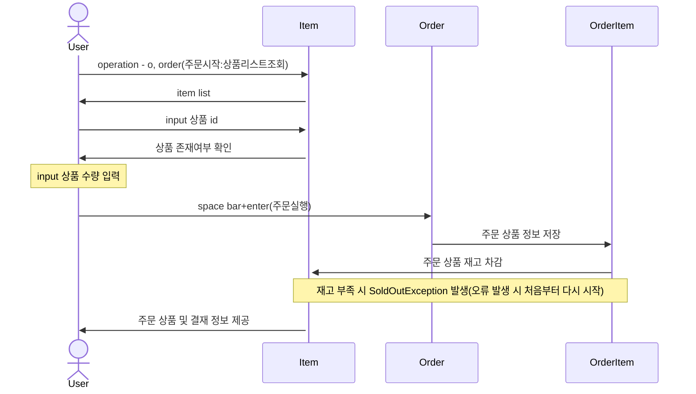

# KIA 과제

## Environments
* Amazon Corretto Version 17.0.7
* Spring Boot 3.1.0
* Gradle
* lombok

## Process
### html String filtering

```mermaid
sequenceDiagram
    actor User
    participant Item
    participant Order
    participant OrderItem
    User->>Item: operation - o, order(주문시작:상품리스트조회)
    activate Item
    Item->>User: item list
    
    User->>Item: input 상품 id
    Item->>User: 상품 존재여부 확인
    Note over User: input 상품 수량 입력
    User->>Order: space bar+enter(주문실행)
    
    Order->>OrderItem: 주문 상품 정보 저장
    OrderItem->>Item: 주문 상품 재고 차감
    Note over Item, OrderItem: 재고 부족 시 SoldOutException 발생(오류 발생 시 처음부터 다시 시작)  
    
    Item->>User: 주문 상품 및 결재 정보 제공    
```
# 프로젝트 패키지 구성

# 프로젝트 테스트 코드 구성 

## 프로젝트 회고
