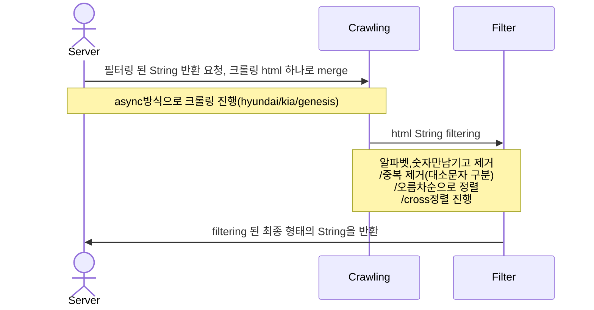

# KIA 과제
---------------------------------------
## Environments
* Amazon Corretto Version 17.0.7
* Spring Boot 3.1.0
* Gradle
* lombok
* jsoup
---------------------------------------
## Process
### html filtering

---------------------------------------
## 프로젝트 패키지 구성
> src.main.javacom.kia.assignment
>	> controller
>	> constant
>	> dto
>	> service
> src.test.java.com.kia.assignment
>	> controller
>	> ervice
---------------------------------------
## 프로젝트 테스트 코드 구성 
1. FilterStringControllerTest.java - 문자열 출력 api 컨트롤러 테스트
    * givenTestData_whenGetFilterString_thenResponseCheck
      
      response status, body json 검증, content type(json)
      
    * givenTestDataNothing_whenGetFilterString_thenApplyEhcacheCheck
      
      ehcache 테스트
      
3. CrawlingServiceTest.java - 크롤링 테스트
    * givenTestDataNothing_whenGetAllAsyncCrawling_thenGetHtmlStringCheck
      
      정상 html merge return 테스트
      
    * givenTestData_whenGetCrawlingByUrlAndGetAllAsyncCrawling_thenTimeCheck
      
      크롤링 대상 하나에 소모되는 시간과 전체 크롤링에 소모 시간 테스트
      
    * givenTestDataNothing_whenAsyncWork_thenExcuteIgnoreOrderCheck
      
      async 처리가 되는데 순서 상관없이 실행되는지 테스트
      
4. MakeStringServiceTest.java - 문자열 생성 테스트
    * givenTestData_whenGetFilterByString_thenResultCheck
      
      문자열 필터링 테스트 (전처리 & 교차정렬)
      
    * givenTestData_whenGetFilterCharByString_thenPreProcessCheck
      
      문자열 전처리 테스트 (숫자,알파벳만 남기고 제거/중복제거/오름차순정렬)
      
    * givenTestData_whenGetCrossSort_thenCrossSortCheck
      
      교차 정렬이 제대로 되었는지 확인
      
---------------------------------------
## 프로젝트 회고
